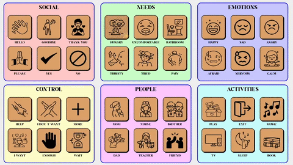
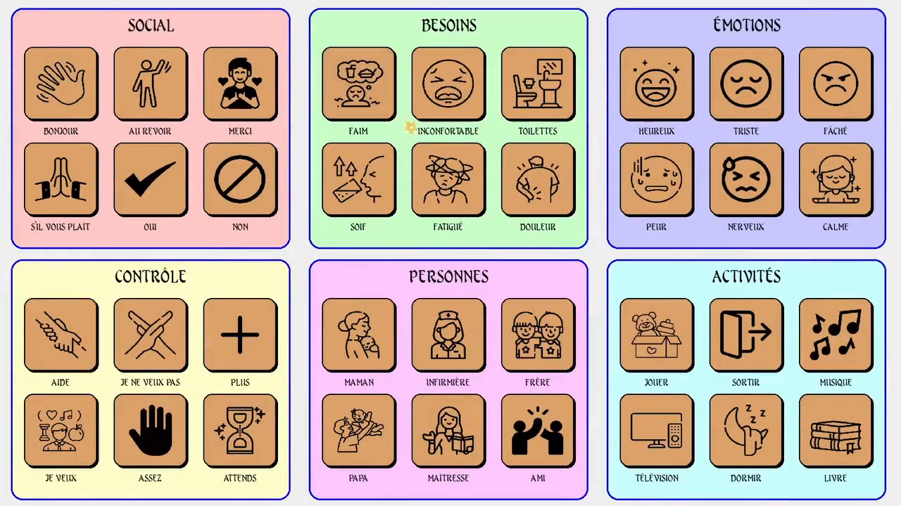

<div align="center">

# 🎮👁️ SIMUS.MJN — DEMO

**Software educativo de comunicación aumentativa con control por movimientos de cabeza y parpadeos.**

Versión de demostración **sin base de datos, sin licencia y sin login**:
tutorial, menú principal, pantalla de inicio, configuración y **5 juegos**.

🪟 Windows 10/11 &nbsp;·&nbsp; 🐍 Python 3.10-3.12 &nbsp;·&nbsp; 📷 Webcam requerida

</div>

---

## 🎬 Mira el trailer

**Vista previa animada** (se reproduce sola):



**Trailer completo** — haz clic en la imagen y se reproduce directamente en el visor de GitHub (no se descarga nada):

[](Trailer_Simus.mp4)

---

## 🚀 Guía paso a paso para instalarlo (5 minutos)

### ✅ Paso 1 — Descarga el proyecto

Haz clic en el botón verde **Code → Download ZIP** o usa este enlace directo:

[-2ea043?style=for-the-badge&logo=github)](https://github.com/SamuelDaza21/Simus_Demo/archive/refs/heads/main.zip)

Descomprime el ZIP en una carpeta, por ejemplo `Escritorio\Simus_Demo`.

---

### ✅ Paso 2 — Instala Python (solo si no lo tienes)

1. Haz clic en este enlace para **descargar el instalador de Python 3.10** (el más recomendado para este proyecto):

   [](https://www.python.org/ftp/python/3.10.11/python-3.10.11-amd64.exe)

2. Abre el archivo `python-3.10.11-amd64.exe` que descargaste.
3. ⚠️ **IMPORTANTE:** marca la casilla **"Add python.exe to PATH"** (en la parte inferior de la primera ventana):

   > ✅ `[x] Add python.exe to PATH`

4. Haz clic en **Install Now** y espera a que termine.

> ¿Tienes otra versión? También sirven **Python 3.11 y 3.12**. Descarga la que quieras desde
> [python.org/downloads](https://www.python.org/downloads/). No uses **3.13 ni 3.14**.

---

### ✅ Paso 3 — Instala el demo (solo la primera vez)

Entra a la carpeta `Simus_Demo` que descomprimiste y haz **doble clic** en:

[](https://raw.githubusercontent.com/SamuelDaza21/Simus_Demo/main/Instalar_Demo.bat)

Este archivo **crea el entorno virtual e instala todas las dependencias automáticamente**
(busca Python 3.10/3.11/3.12 en tu equipo). Verás algo así:

```
[DEMO] Buscando Python compatible (3.10 / 3.11 / 3.12)...
[DEMO] Creando entorno virtual con py -3.10...
[DEMO] Instalacion completada. Ejecuta Iniciar_Demo.bat para usar el demo.
```

---

### ✅ Paso 4 — ¡A jugar!

Haz **doble clic** en:

[](https://raw.githubusercontent.com/SamuelDaza21/Simus_Demo/main/Iniciar_Demo.bat)

Se abrirá el demo en pantalla completa. Colócate frente a la cámara y sigue el **tutorial**.

---

## 🕹️ Controles

| Acción | Cómo se hace |
|--------|--------------|
| 🎯 Mover el cursor | Mueve la cabeza |
| 👁️ Hacer clic | Parpadea |
| 🚪 Salir de una pantalla | Tecla `ESC` |
| 📷 Recalibrar la cámara | Tecla `C` |

---

## 🎮 Los 5 juegos del demo

| Juego | Qué es |
|-------|--------|
| 🃏 Pares mágicos | Juego de memoria con tarjetas |
| 🦁 Animalia | Clasifica animales por hábitat |
| 🧩 Mate-reto | Laberintos con preguntas de matemáticas |
| 🔍 Encuentra y aprende | Busca objetos y aprende su nombre |
| 🔤 Caza letras | Encuentra la letra correcta |

---

## 🧩 Diferencias con la versión completa

| Aspecto        | Versión completa       | Demo                     |
|----------------|------------------------|--------------------------|
| Base de datos  | MySQL (servidor Flask) | En memoria (sin red)     |
| Login/sesiones | Usuarios y sesiones    | Sesión demo automática   |
| Licencia       | Clave por máquina      | Sin licencia             |
| Almacenamiento | Archivos y BD          | Nada (no persiste)       |
| Panel de info  | Streamlit/ReportLab    | No disponible            |

---

<div align="center">

**Hecho con 💛 para el proyecto educativo SIMUS.MJN**

</div>
